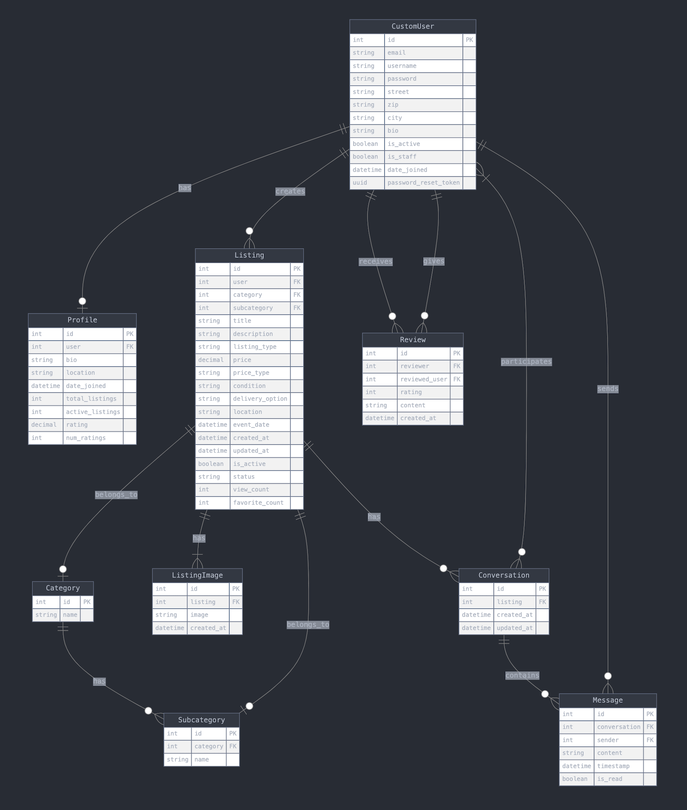

# Local Listing Backend API

## Table of Contents

1. [Project Overview](#project-overview)
   - [Purpose](#purpose)
   - [Features](#features)
   - [Objectives](#objectives)
2. [Features](#features-1)

   - [Key Features Summary](#key-features-summary)
   - [Additional Features Summary](#additional-features-summary)

3. [Technologies Used](#technologies-used)

   - [Languages](#languages)
   - [Frameworks & Libraries](#frameworks--libraries)
   - [Databases](#databases)
   - [Other Tools & Services](#other-tools--services)

4. [Information Architecture](#information-architecture)

   - [Database Schema (ERD Diagram)](#database-schema-erd-diagram)
   - [Data Models Description](#data-models-description)

5. [API Endpoints](#api-endpoints)

6. [Agile Methodology](#agile-methodology)

7. [Version Control](#version-control)

   - [Tools and Workflow](#tools-and-workflow)

8. [Deployment](#deployment)

   - [Deployment Steps](#deployment-steps)

9. [Installation and Local Setup](#installation-and-local-setup)

   - [Prerequisites](#prerequisites)
   - [Installation Steps](#installation-steps)

10. [Testing](#testing)

11. [Unsolved Issues and Bugs](#unsolved-issues-and-bugs)

12. [Future Features](#future-features)

13. [Credits](#credits)

## Project Overview

The **Local Listing Backend API** is a Django-based REST API designed to provide backend services for the local listing platform. The API handles multiple aspects of the application, including user management, listings, messaging, reviews, and more. This backend is intended to serve as the main point of interaction for the React front-end client, providing endpoints to create, read, update, and delete resources, as well as manage user sessions and interactions.

### Purpose

The purpose of this REST API is to provide a robust and scalable backend system that allows users to list and manage items for sale, connect with each other, and manage profiles. It is intended to serve as the data and business logic layer for a complete web application, handling all backend requirements and data processing.

### Features

- **User Management**: Registration, login, password management, and user profiles.
- **Listings**: Creating, updating, deleting, and viewing listings of items for sale, wanted items, services, events, etc.
- **Messaging**: Provides communication between users, allowing them to send messages related to specific listings.
- **Reviews**: Users can leave reviews for other users to enhance reliability and trust.
- **Admin Features**: Administrative endpoints for managing all presented features in the API.

### Objectives

The objective of this project is to build a REST API backend that supports all necessary features of a local listing platform. The API aims to:

- Provide a clean and scalable interface for data interaction.
- Ensure secure handling of user data, including authentication and authorization mechanisms.
- Offer an efficient and user-friendly approach to managing listings, reviews, and interactions.
- Facilitate a maintainable and extendable codebase, which adheres to best practices in API development.

## Features

### Key Features Summary

1. **User Management**

   - **Registration and Login**: Users can create accounts, log in, and manage their sessions. This includes support for password reset.
   - **Profile Management**: Users can update their personal details.

2. **Listings Management**

   - **Create Listings**: Users can create different types of listings.
   - **Update and Delete Listings**: Users can update the details of their listings or delete them when no longer needed.
   - **Category and Subcategory Support**: Listings are organized by categories and subcategories, providing better navigation and filtering capabilities.
   - **Listing Images**: Users can upload images to be associated with their listings, using integration with Cloudinary for image management. Images are deleted from Cloudinary when the listing is deleted or the user chooses to remove them in the update process.

3. **Search and Filter Listings**

   - **Advanced Filtering**: Users can filter listings based on price range, category, subcategory, location, condition, and more.
   - **Search Functionality**: Full-text search capabilities are provided to quickly find relevant listings.

4. **Messaging System**

   - **User Conversations**: Users can initiate conversations related to specific listings. Conversations between users are managed through a messaging system that allows users to ask questions and negotiate.
   - **Notifications**: Users receive notifications for new messages, ensuring prompt communication.

5. **Reviews and Ratings**

   - **Leave Reviews**: Users can leave reviews and ratings for other users based on past experience. This helps build trust within the platform.
   - **Manage Reviews**: Users can edit or delete the reviews they have left for others. A single review can be left per reviewed user.

6. **Admin and Staff Features**

   - **Admin Dashboard**: Administrators have access to endpoints that allow them to manage all aspects of the platform.
   - **User Management**: Admins can deactivate or delete listings and users.
   - **Listings Moderation**: Admins can approve, reject, or moderate listings to ensure compliance with platform guidelines. This is also a feature that can be extended in future iterations to develop user report mechanisms.

7. **Favorites and Wishlist**

   - **Favorite Listings**: Users can add listings to their favorites for easy access later. This helps users keep track of items they are interested in.

8. **Notifications and Alerts**

   - **Activity Notifications**: Users are notified of important activities and platform interactions, such as new messages, listing approvals, etc.

### Additional Features Summary

- **Password Reset via Email**: Users can reset their passwords using a secure link sent to their registered email address.

Note: In order to test this features, the email account used for account registration must be valid to receive the password reset email. In this current iteration, the email is not verified upon registration. The email service used for this feature is SendGrid.

- **Tokens and Refresh Tokens**: The API uses JWT tokens for authentication and refresh tokens to manage user sessions securely.
- **Multi-Image Upload**: Users can upload multiple images for a single listing, giving more context and details to potential buyers.
- **Cloudinary Integration**: Listings' images are handled using Cloudinary, providing efficient image storage, optimization, and delivery.
- **Location-Based Filtering**: Users can filter listings based on location to find items near them. This feature can be extended to include distance-based filtering in future iterations.
- **Statistics**: Listings have view counts.
- **Pagination**: The listings endpoint supports pagination to manage large datasets efficiently. Unfortunately, due to time constraints, the pagination feature is not yet implemented in the frontend client, but it was tested and works as expected in the backend.

## Technologies Used

### Languages

- **Python**: The primary language used to develop the backend logic and API endpoints.

### Frameworks & Libraries

- **Django**: A high-level Python web framework used to create the backend of the application.
- **Django REST Framework (DRF)**: Extends Django to provide a powerful toolkit for building Web APIs.
- **Django Filters**: Used to provide filtering capabilities for querysets in the API.
- **Cloudinary**: Integrated for handling media storage, specifically for listing images.

### Databases

- **PostgreSQL**: Used as the primary database for storing all application data, including user information, listings, reviews, and messages. The database is provided by Code Institute.

### Other Tools & Services

- **Cloudinary**: Provides cloud storage for user-uploaded images, optimizing and delivering images efficiently.
- **SendGrid**: Used to handle transactional emails, such as registration confirmation and password resets.
- **Gunicorn**: A Python WSGI HTTP server used for deploying the application.
- **Heroku**: Platform-as-a-service (PaaS) used for hosting and deploying the backend API.
- **Postman**: Utilized during development for testing the API endpoints.

[Back to top](#local-listing-backend-api)

## Information Architecture

### Database Schema

The database schema consists of multiple interconnected models, each representing a key entity in the application. The primary models are **User**, **Listing**, **Category**, **Subcategory**, **Message**, **Review**, and **ListingImage**. The relationships between these models include:

- **User**: Represents the users of the platform. Each user can create multiple listings, leave reviews, and participate in conversations.
- **Listing**: Represents the items listed by users. Each listing is linked to a **User**, **Category**, and optionally a **Subcategory**. Listings can have multiple associated **ListingImage** entries.
- **Category and Subcategory**: Listings are categorized to improve searchability and user navigation. **Category** and **Subcategory** models define these relationships.
- **Message**: Represents messages exchanged between users related to listings. Each message is linked to a **User** and a **Listing**.
- **Review**: Represents user reviews for listings. Each review is linked to a **User** and a **Listing**.
- **ListingImage**: Represents images associated with a listing. Each image entry is linked to a specific **Listing**.

### Data Models Description

- **User Model**: Contains fields such as `username`, `email`, `password`, `profile_picture`, and `date_joined`. Users have role-based access to resources, and their relationships include creating listings, reviews, and messaging.
- **Listing Model**: Contains fields such as `title`, `description`, `price`, `condition`, `listing_type`, `category`, `subcategory`, `location`, `created_at`, and `updated_at`. Listings have foreign key relationships with **User**, **Category**, and **Subcategory**.
- **Category and Subcategory Models**: Categories contain general classification information, while subcategories provide more granularity. Fields include `name` and foreign key references to maintain relationships.
- **Message Model**: Contains `content`, `timestamp`, `sender`, and `listing` to support user-to-user communication regarding listings.
- **Review Model**: Contains `rating`, `comment`, `user`, `listing`, and `created_at` to manage user feedback for listings.
- **ListingImage Model**: Contains `listing`, `image`, and `created_at` fields, storing image URLs using Cloudinary integration.



### API Endpoints

The following is a summary of key API endpoints provided by the Local Listing Backend API:

1. **User Endpoints**

   - **POST /api/users/register/**: Register a new user.
   - **POST /api/users/login/**: User login to obtain authentication token.
   - **POST /api/users/password-reset-request/**: Request a password reset email.
   - **POST /api/users/password-reset-confirm/**: Confirm a password reset using the token.
   - **POST /api/users/change-password/**: Change the user password.
   - **GET /api/users/profile/**: Retrieve the logged-in user's profile.
   - **PUT /api/users/profile/update/**: Update user profile details.
   - **POST /api/users/logout/**: Log out the user and blacklist the refresh token.

2. **Listing Endpoints**

   - **GET /api/listings/**: Retrieve a list of all listings with optional filters.
   - **POST /api/listings/create/**: Create a new listing.
   - **GET /api/listings/{id}/**: Retrieve details of a specific listing.
   - **PUT /api/listings/{id}/update/**: Update an existing listing.
   - **DELETE /api/listings/{id}/delete/**: Delete a listing.
   - **PATCH /api/listings/{id}/update-status/**: Update the status of a specific listing.
   - **GET /api/my-listings/**: Retrieve all listings created by the authenticated user.

3. **Category and Subcategory Endpoints**

   - **GET /api/categories/**: Retrieve all categories.
   - **GET /api/categories/{id}/**: Retrieve details of a specific category.
   - **GET /api/subcategories/**: Retrieve all subcategories.
   - **GET /api/subcategories/{id}/**: Retrieve details of a specific subcategory.
   - **GET /api/subcategories/by-category/{category_id}/**: Retrieve subcategories under a specific category

   Note: The categories and subcategories can me managed only in the admin panel, users utilize them as read-only data.

4. **Messaging Endpoints**

   - **GET /api/conversations/**: Retrieve all conversations of the authenticated user or create a new one.
   - **POST /api/conversations/{conversation_id}/messages/**: Send a message within a specific conversation.
   - **POST /api/conversations/{conversation_id}/mark-as-read/**: Mark messages in a conversation as read.
   - **GET /api/unread-messages/**: Retrieve the count of unread messages for the authenticated user.
   - **GET /api/listing/{listing_id}/messages/**: Retrieve incoming messages for a specific listing.

   Note: In this current iteration, the messages cannot be deleted or updated by the user. This feature can be extended in future iterations.

5. **Review Endpoints**

   - **POST /api/users/{user_id}/reviews/**: Create or update a review for a user.
   - **GET /api/users/{user_id}/reviews/**: Retrieve all reviews for a specific user.
   - **GET /api/reviews/{id}/**: Retrieve details of a specific review.
   - **DELETE /api/reviews/{id}/delete/**: Delete a specific review.

6. **Profile Endpoints**

   - **GET /api/profiles/profile/**: Retrieve the authenticated user's profile.
   - **GET /api/profiles/{username}/**: Retrieve the public profile of a specific user by username.
   - **GET /api/listings/user/{username}/**: Retrieve all active listings for a specific user.

7. **Favorite Listings Endpoints**

   - **GET /api/favorites/**: Retrieve all listings favorited by the authenticated user.
   - **POST /api/listings/{id}/favorite/**: Add or remove a listing from the user's favorites.

[Back to top](#local-listing-backend-api)

## Agile Methodology

The development of the Local Listing Backend API followed an **Agile methodology**, specifically using **Kanban** for task management.
Kanban board can be accessed [here](https://github.com/users/zioan/projects/6).

- **Kanban Board (GitHub Project Board)**: A Kanban board was used to manage tasks (issues), allowing for better visualization of progress and bottlenecks. Each task was categorized as "To Do", "In Progress", "In Review", or "Done", making it easy to track the development flow.

- **User Stories**: User stories were defined to capture the requirements from an end-user perspective. Each feature, such as user registration, listing creation, messaging, and review management, was documented as a user story to ensure it delivered value to the user. User stories were prioritized based on their impact and complexity using MOSCOW prioritization.

## Version Control

Throughout the development process, Git was used for version control, with Visual Studio Code (VS Code) as the primary Integrated Development Environment (IDE). GitHub was used to host the remote repository.

### Tools and Workflow

1. **Development Environment**:

   - **VS Code**: Utilized as the primary IDE for developing the API. Its integrated terminal was used for running Django commands and managing the virtual environment.

2. **Source Control Panel**:

   - VS Code's **Source Control** panel was used extensively to manage code changes, particularly when working on multiple apps, views, and URLs. This panel allowed easy visualization of changes and helped in logically grouping updates into meaningful commits.

3. **Commit Strategy**:

   - Given the interconnected nature of the Django project, changes often spanned across multiple files, such as models, views, serializers, and URL configurations. The **diff viewer** in VS Code was used to carefully review changes before creating commits.
   - The commit messages were kept descriptive to ensure clarity of the project's evolution, making it easier for future maintainability.

4. **Key Git Commands**:

   - **`git add <file>`** or **`git add .`**: To stage changes.
   - **`git commit -m "descriptive message"`**: To commit changes with a meaningful message.
   - **`git push`**: To push the local commits to the GitHub repository.

5. **Remote Synchronization**:
   - Regularly used **`git pull`** to sync the local repository with the latest changes on the remote GitHub repository. This practice helped avoid conflicts after modifying the project board or issues.

By leveraging Git and GitHub's integration with VS Code, a clean and understandable version history was maintained, even while managing the complex architecture of the Django REST API project.

[Back to top](#local-listing-backend-api)

## Deployment

The Local Listing Backend API was deployed using **Heroku**, a cloud Platform-as-a-Service (PaaS) that simplifies deployment and scaling of web applications. The deployment process involved setting up the necessary environment, pushing the code to Heroku, and ensuring that all services were running smoothly.

### Deployment Steps

1. **Heroku Setup**:

   - Created a new application on the Heroku platform via the Heroku dashboard.
   - Configured the necessary environment variables, such as database credentials, secret keys, and API keys, using the Heroku Config Vars feature.

2. **Procfile and Gunicorn**:

   - A **Procfile** was added to the project to specify the command that Heroku should use to start the application. This included using **Gunicorn** as the WSGI HTTP server.

3. **Dependencies**:

   - All project dependencies were listed in the **`requirements.txt`** file, which was used by Heroku during the build process to install the necessary packages.
   - **Whitenoise** was used to serve static files, ensuring efficient handling of assets.

4. **Database Configuration**:

   - **PostgreSQL** was used as the production database. The database is provided by Code Institute.
   - Django settings were updated to use `dj-database-url` for parsing the database URL provided by Heroku.

5. **Static Files**:

   - **Whitenoise** was configured to handle static files.

6. **Deployment Process**:

   - The code was pushed to the Heroku remote repository using Git:
     ```
     git push heroku main
     ```
   - Heroku then built the application, installed dependencies, and started the web server using Gunicorn.

7. **Monitoring and Logs**:

   - **Heroku Logs**: Logs were monitored using the command:
     ```
     heroku logs --tail
     ```
     This helped in identifying any issues during deployment and in ensuring that the application was running smoothly.

### Deployment Summary

Deploying the API to Heroku allowed for a seamless and scalable deployment process, leveraging Heroku's managed services to handle the complexities of server setup. By using **Gunicorn**, **Whitenoise**, and **Code Institute Postgres Database**, the application was able to serve both dynamic content and static assets efficiently, providing a smooth user experience.

[Back to top](#local-listing-backend-api)

## Installation and Local Setup

To set up the Local Listing Backend API locally, follow these instructions to ensure that all dependencies are installed correctly, the development server runs as expected, and the environment is properly configured.

### Prerequisites

- **Python 3.8+**: Ensure Python is installed. You can download it from [python.org](https://www.python.org/downloads/).
- **Git**: Version control system to clone the repository. Install from [git-scm.com](https://git-scm.com/).
- **PostgreSQL**: Required for the database setup.

### Installation Steps

1. **Clone the Repository**

   - Use Git to clone the project repository from GitHub:
     ```
     git clone https://github.com/username/project_name.git
     ```
   - Navigate into the project directory:
     ```
     cd project_name
     ```

2. **Create a Virtual Environment**

   - It is recommended to use a virtual environment to keep dependencies isolated:
     ```
     python -m venv venv
     ```
   - Activate the virtual environment:
     - On Windows:
       ```
       venv\Scripts\activate
       ```
     - On macOS/Linux:
       ```
       source venv/bin/activate
       ```

3. **Install Dependencies**

   - Install the required packages using **`pip`**:
     ```
     pip install -r requirements.txt
     ```

4. **Environment Variables**

   - Create a **`.env`** file in the root of your project to store environment variables. Add the following variables:

     ```
     SECRET_KEY=your_secret_key
     DEBUG=True
     DATABASE_URL=your_postgresql_database_url
     CLOUDINARY_CLOUD_NAME=your_cloudinary_cloud_name
     CLOUDINARY_API_KEY=your_cloudinary_api_key
     CLOUDINARY_API_SECRET=your_cloudinary_api_secret
     SENDGRID_API_KEY=your_sendgrid_api_key
     DEFAULT_FROM_EMAIL=your_default_from_email
     FRONTEND_URL=your_frontend_url
     ```

5. **Database Migration**

- Apply migrations to set up the database:
  ```
  python manage.py migrate
  ```

6. **Create a Superuser**

   - Create an admin user to access the Django admin interface:
     ```
     python manage.py createsuperuser
     ```
   - Follow the prompts to set up the superuser credentials.

7. **Collect Static Files**

   - Collect all static files to be served:
     ```
     python manage.py collectstatic
     ```

8. **Run the Development Server**
   - Start the development server to test the application locally:
     ```
     python manage.py runserver
     ```
   - The API should now be accessible at `http://127.0.0.1:8000/`.

### Additional Setup

- **Postman**: Use [Postman](https://www.postman.com/) to test the API endpoints. Import the provided collection or create your own requests to interact with the API.
- **Heroku CLI** (Optional): If you wish to deploy the project to Heroku, install the [Heroku CLI](https://devcenter.heroku.com/articles/heroku-cli) to manage your Heroku applications from the terminal.

### Summary

These steps will set up the Local Listing Backend API on your local machine, allowing you to explore, modify, and test the application in a development environment. Ensure all configurations are set correctly to avoid issues during runtime.

[Back to top](#local-listing-backend-api)

## Testing

Testing was a crucial aspect of the development process for ensuring the robustness and reliability of the Local Listing Backend API. The project used a combination of manual testing and automated testing frameworks to validate the functionality of the API endpoints and ensure that they performed as expected.

### Python (PEP8) Validation

Python code was validated using Black Formatter VS Code extension during development. All custom Python files were checked using the Code Institute PEP8 Validator as part of the final validation process. No errors or warnings were found in the codebase.


### Testing Tools

- **Django's Test Framework**: Used to create and run unit tests for the various components of the application.
- **Postman**: Used extensively for manual testing of the API endpoints during development.

### Types of Tests

1. **Unit Tests**

   - Unit tests were created for models, views, and serializers to ensure that each individual component worked correctly.
   - Example command to run unit tests:
     ```
     python manage.py test
     ```

2. **End-to-End (E2E) Tests**
   - Postman was used to manually test complete user flows, such as creating a user, adding a listing, and sending messages. This helped verify that the system behaved as expected from the user's perspective.

### Running Tests

- To run all tests for the application, use the following command:
  ```
  python manage.py test
  ```
  The result of the tests can be visualized in the following screenshot:


#### Listings App Tests

The tests for the listings app cover the core functionality of categories, subcategories, listings, serializers, and API views. These tests ensure that the models and API endpoints function as expected and data is handled correctly.

| Test Name                            | Description                                          | Assertion                                                             |
| ------------------------------------ | ---------------------------------------------------- | --------------------------------------------------------------------- |
| `test_category_creation`             | Tests the creation of a Category instance            | Verifies the correct category name and string representation          |
| `test_subcategory_creation`          | Tests the creation of a Subcategory instance         | Verifies subcategory attributes and relationships                     |
| `test_listing_creation`              | Tests the creation of a Listing instance             | Verifies listing attributes and relationships                         |
| `test_contains_expected_fields`      | Tests the CategorySerializer for expected fields     | Ensures the expected fields are in the serialized data                |
| `test_contains_expected_fields`      | Tests the SubcategorySerializer for expected fields  | Ensures the expected fields are in the serialized data                |
| `test_contains_expected_fields`      | Tests the ListingSerializer for expected fields      | Ensures the expected fields are in the serialized data                |
| `test_create_valid_listing`          | Tests creating a new listing with valid data         | Verifies a valid listing is created successfully                      |
| `test_create_invalid_listing`        | Tests creating a new listing with invalid data       | Verifies that creating a listing with invalid data returns 400 error  |
| `test_retrieve_listing`              | Tests retrieving a specific listing                  | Verifies that a listing is retrieved correctly                        |
| `test_update_listing`                | Tests updating an existing listing                   | Verifies a listing is updated successfully with valid data            |
| `test_delete_listing`                | Tests deleting an existing listing                   | Verifies a listing is deleted successfully                            |
| `test_get_all_categories`            | Tests retrieving all categories                      | Ensures that all categories are returned successfully                 |
| `test_get_all_subcategories`         | Tests retrieving all subcategories                   | Ensures that all subcategories are returned successfully              |
| `test_get_subcategories_by_category` | Tests retrieving subcategories by category           | Verifies correct subcategories are returned for a specific category   |
| `test_get_my_listings`               | Tests retrieving listings for the authenticated user | Ensures the authenticated user's listings are returned                |
| `test_get_favorite_listings`         | Tests retrieving favorite listings                   | Ensures the authenticated user's favorite listings are returned       |
| `test_toggle_favorite`               | Tests toggling the favorite status of a listing      | Verifies that a listing can be favorited and unfavorited successfully |

#### Messaging App Tests

The messaging app tests cover the core functionality of conversations, messages, and related API views. These tests ensure that conversations and messages are correctly created, retrieved, and managed through the API.

| Test Name                         | Description                                                       | Assertion                                                     |
| --------------------------------- | ----------------------------------------------------------------- | ------------------------------------------------------------- |
| `test_conversation_creation`      | Tests the creation of a Conversation instance                     | Verifies the correct listing and participants are associated  |
| `test_message_creation`           | Tests the creation of a Message instance                          | Verifies the correct conversation, sender, and content        |
| `test_conversation_serializer`    | Tests the ConversationSerializer output structure                 | Ensures the serialized data contains the expected fields      |
| `test_message_serializer`         | Tests the MessageSerializer output structure                      | Ensures the serialized data contains the expected fields      |
| `test_conversation_list_create`   | Tests the GET and POST methods of the ConversationListCreate view | Verifies correct retrieval and creation of conversations      |
| `test_message_list_create`        | Tests the GET and POST methods of the MessageListCreate view      | Verifies correct retrieval and creation of messages           |
| `test_mark_messages_as_read`      | Tests marking messages as read                                    | Ensures the selected messages are marked as read successfully |
| `test_unread_message_count`       | Tests the unread message count API endpoint                       | Verifies the correct number of unread messages is returned    |
| `test_conversation_unread_counts` | Tests the unread message count per conversation endpoint          | Verifies correct unread counts for each conversation          |
| `test_listing_incoming_messages`  | Tests retrieving incoming messages for a specific listing         | Ensures correct incoming messages for a listing are retrieved |

#### Profiles App Tests

The profile app tests cover the core functionality of profile creation, updating, and retrieval, as well as the related API views and serializers. These tests ensure that profiles are correctly handled in the system and that the necessary fields are serialized properly.

| Test Name                         | Description                                                      | Assertion                                                              |
| --------------------------------- | ---------------------------------------------------------------- | ---------------------------------------------------------------------- |
| `test_profile_creation`           | Tests the automatic creation of a profile when a user is created | Verifies that a profile is created and linked to the user              |
| `test_profile_str_representation` | Tests the string representation of a Profile instance            | Ensures the correct string format for the profile                      |
| `test_update_listing_counts`      | Tests the update_listing_counts method of the Profile model      | Verifies the correct counting of total and active listings             |
| `test_profile_detail_view`        | Tests the ProfileDetailView for authenticated users              | Ensures the profile data is returned for the authenticated user        |
| `test_public_profile_view`        | Tests the PublicProfileView                                      | Verifies the correct retrieval of a public profile by username         |
| `test_user_listings_view`         | Tests the UserListingsView                                       | Ensures the correct number of listings is returned for a specific user |
| `test_profile_serializer`         | Tests the ProfileSerializer                                      | Verifies the serialized data includes the expected profile fields      |
| `test_private_profile_serializer` | Tests the PrivateProfileSerializer                               | Verifies the serialized data includes sensitive fields like email      |

#### Reviews App Tests

The review app tests cover the core functionality of creating, updating, deleting, and retrieving reviews, as well as the related API views and serializers. These tests ensure that reviews function correctly and that the necessary fields are properly serialized.

| Test Name                                         | Description                                          | Assertion                                                                  |
| ------------------------------------------------- | ---------------------------------------------------- | -------------------------------------------------------------------------- |
| `test_review_creation`                            | Tests the creation of a Review instance              | Verifies the correct attributes (reviewer, reviewed user, rating, content) |
| `test_review_str_representation`                  | Tests the string representation of a Review instance | Ensures the correct string format for the review                           |
| `test_create_review`                              | Tests creating a new review via API                  | Verifies that a review is created successfully                             |
| `test_list_reviews`                               | Tests listing reviews for a user                     | Ensures that all reviews for the user are returned                         |
| `test_update_review`                              | Tests updating an existing review                    | Verifies that the review is updated successfully                           |
| `test_delete_review`                              | Tests deleting a review                              | Ensures the review is deleted successfully                                 |
| `test_review_serializer_contains_expected_fields` | Tests the ReviewSerializer for expected fields       | Ensures the serialized data contains the expected fields                   |
| `test_review_serializer_content`                  | Tests the content of the ReviewSerializer            | Verifies that the Review instance is serialized with correct values        |

#### User App Tests

The user app tests cover the core functionality of user creation, profile management, and authentication, as well as the related API views and serializers. These tests ensure that users can be created, updated, logged in, logged out, and managed correctly.

| Test Name                                       | Description                                              | Assertion                                                            |
| ----------------------------------------------- | -------------------------------------------------------- | -------------------------------------------------------------------- |
| `test_user_creation`                            | Tests creating a user with correct attributes            | Verifies that a user is created successfully with the correct data   |
| `test_user_str_representation`                  | Tests the string representation of a CustomUser instance | Ensures the correct string format for the user                       |
| `test_user_registration`                        | Tests registering a new user via API                     | Verifies that a new user is registered successfully                  |
| `test_user_profile_retrieval`                   | Tests retrieving the authenticated user's profile        | Ensures the correct profile data is returned                         |
| `test_user_profile_update`                      | Tests updating the authenticated user's profile          | Verifies that the user's profile is updated successfully             |
| `test_user_logout`                              | Tests logging out the user                               | Ensures the user is logged out and token is blacklisted successfully |
| `test_change_password`                          | Tests changing the user's password                       | Verifies that the user's password is changed successfully            |
| `test_user_serializer_contains_expected_fields` | Tests the UserProfileSerializer for expected fields      | Ensures the serialized data contains the expected profile fields     |
| `test_user_serializer_content`                  | Tests the content of the UserProfileSerializer           | Verifies that the User instance is serialized with correct values    |

### Manual Testing

- **Postman** was used to manually test each API endpoint during development to confirm proper functionality.
- Test cases included verifying correct responses for various request types (GET, POST, PUT, DELETE) and ensuring appropriate error messages were returned for invalid requests.

### Summary

Testing the Local Listing Backend API involved a combination of unit and manual tests to ensure the functionality and reliability of the application. By using Django's built-in test framework and Postman for manual testing, the project achieved a stable and reliable backend service.

## Unsolved Issues and Bugs

During the development and testing phases of the Local Listing Backend API, several issues were found and solved. Below is a summary of the known issues and some improvements that could be made in future iterations.

### 1.Database Connection Consistency

Database connection (provided by Code Institute) seems to be inconsistent from time to time, leading to occasional connection errors. Fortunately, the frontend client handles these errors gracefully, triggering a 500 error message to the user. Usually, refreshing the page resolves the problem and the issue is not persistent.
This is a screen capture of the error message:


### 2. Messaging System Delay

- **Issue**: There is a delay in real-time messaging updates between users. This may lead to users not seeing new messages immediately.
- **Cause**: The delay is related to the polling interval set for retrieving new messages.
- **Proposed Solution**: Future iterations could include integrating WebSockets to provide real-time messaging updates between users.

### 3. Image Upload Timeout for Large Files

- **Issue**: Uploading very large images (over 10MB) can sometimes result in a timeout error.
- **Cause**: The issue is related to both the server’s upload size limit and the Cloudinary integration.
- **Proposed Solution**: Future iterations could include client-side image resizing before upload or server-side chunked uploads to handle large files more efficiently.

[Back to top](#local-listing-backend-api)

## Future Features

To further enhance the Local Listing Backend API and provide an even better user experience, several features are planned for future development. These features aim to improve usability, increase engagement, and add new capabilities to the platform. Some of these features are already mentioned in the related sections.

### 1. Real-Time Messaging

- **Feature**: Upgrade the existing messaging system to support real-time communication using WebSockets.
- **Benefit**: This will provide users with a seamless chat experience, similar to popular messaging platforms, reducing delays and improving interaction quality.

### 2. Advanced Search and Filtering

- **Feature**: Implement more sophisticated search options, including fuzzy matching, keyword relevance, and advanced filters based on user preferences.
- **Benefit**: Users will be able to find listings more easily, even if their search terms are slightly misspelled or if they want more specific results.

### 3. Location-Based Listing Suggestions

- **Feature**: Integrate a location-based recommendation engine that suggests listings based on the user's geographic location.
- **Benefit**: This will improve the relevance of listings shown to users, making it easier to find items and services nearby.

### 4. Listing Analytics for Users

- **Feature**: Provide listing owners with detailed analytics on their listings, such as view counts, interest rates, and user interactions.
- **Benefit**: Listing owners will gain insights into how well their listings are performing, allowing them to optimize their descriptions or adjust prices based on user behavior.

### 5. Advanced User Settings

- **Feature**: Expand user settings to include preferences for notifications, privacy settings, and custom profile options.
- **Benefit**: Users will have more control over their experience on the platform, allowing them to tailor it to their needs and preferences.

### 6. User Badges and Reputation System

- **Feature**: Introduce a badge and reputation system based on user activity, successful transactions, and positive reviews.
- **Benefit**: This will encourage trust within the platform, rewarding users who contribute positively and fostering a sense of community.

### 7. Scheduled Listing Expiry

- **Feature**: Allow users to set an expiry date for their listings, after which the listing will automatically be archived.
- **Benefit**: This will help keep the platform updated with relevant listings and reduce clutter from outdated posts.

### 8. Multi-Language Support

- **Feature**: Add multi-language support to the API, enabling the platform to serve a more diverse user base.
- **Benefit**: Users from different regions will be able to use the platform in their preferred language, enhancing accessibility and user satisfaction.

### 9. In-App Notifications

- **Feature**: Implement in-app notifications in addition to email notifications, allowing users to receive updates directly within the application.
- **Benefit**: Users will have a more integrated experience, reducing the need to check their email for important alerts.

### 10. Report and Moderation System

- **Feature**: Introduce a reporting system for users to flag inappropriate content or behavior, with moderation tools for administrators.
- **Benefit**: This will help maintain a safe and respectful environment on the platform, ensuring that users can report issues and receive timely responses.

### 11. Featured Listings and Promotions

- **Feature**: Offer users the option to promote their listings for a fee, featuring them prominently on the platform.
- **Benefit**: This will provide users with additional visibility for their listings, helping them reach a larger audience and increase sales.

### Summary

The future features of the Local Listing Backend API are focused on improving the overall user experience, enhancing engagement, and making the platform more interactive and accessible. These planned upgrades will ensure the platform remains competitive and continues to meet the evolving needs of its user base.

[Back to top](#local-listing-backend-api)

## Credits

The development of the Local Listing Backend API was made possible thanks to various tools, and resources. Below is a list of credits for code, media, and tools that were instrumental in building this project.

A special thank to my mentor Spencer Barriball, who provided valuable guidance and feedback throughout the development process.

### Code and Inspiration

- **Code Institute Learning Materials**: The Django Full Stack Developer course provided the foundational knowledge and guidance for building the Local Listing Backend API.
- **Python Documentation**: The Python documentation was a valuable resource for understanding the language features and best practices.
- **Django Official Documentation**: The official documentation served as the primary resource for understanding Django’s capabilities and implementing best practices.
- **Cloudinary**: Integrated for handling media storage. The Cloudinary Python SDK and tutorials made media handling efficient and straightforward.
- **SendGrid**: Used for sending password reset emails. The SendGrid API documentation and Python library were instrumental in setting up the email service.
- **Previous Coding Experiences**: Professional coding experiences in technologies like Laravel, Express.js, and Next.js provided a solid foundation for understanding backend development concepts, making Django implementation smoother.

Note: The project codebase was developed from scratch, incrementally building features, with inspiration drawn from various online resources, tutorials, and documentation to ensure best practices and efficient implementation. No code was literally copied from external sources.

### Tools

- **Visual Studio Code (VS Code)**: The main IDE used for development. The extensions for Python, Django, and Git made the coding process smoother and more productive.
- **GitHub**: Used for version control and collaborative development.
- **Postman**: Essential for testing API endpoints during the development cycle, ensuring that each feature functioned as intended.
- **Heroku**: Provided the deployment platform for the API.

[Back to top](#local-listing-backend-api)
